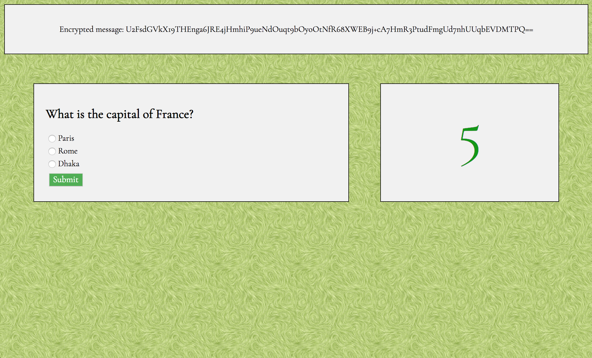

## Rezonence Tech Test
This app was built as the solution to a tech test set by Rezonence. An encrypted message is stored on the server. It can be decrypted with a key. Users answer a multiple choice question in order to decrypt the message: each answer has a key but only one of them – the correct answer – will work. To test myself further I decided to implement the 'Mission Impossible' version of the app, which gives the user just 5 seconds to answer the question.

#### My Approach
I decided to build the app with Node.js, as it provides an elegant method for server construction, and is easily testable and deployable. The front-end is templated using EJS.

My development of the app was Behaviour Driven using the Cypress testing framework. I also decided to use real encryption via the CryptoJS node package, and my encryption module is unit tested using Jest.

Making a GET request to `/message` funnels the encrypted message and the quiz question to the message view. Submitting an answer to the quiz makes a POST request to `/decrypt`. The key is in the body of the request and is passed as an argument to the decrypt function of the encryption module. If the key is correct, the message is decrypted and the user directed to a page that displays it. Otherwise, the user is redirected to a 'wrong answer' page and offered the opportunity to try again.

I used ESLint to detect and correct linting errors.

#### Running the App
To run the app on your machine, clone this repo, `cd` into it, run `npm install` to install the dependencies and `npm start` to fire up the server, then navigate to http://localhost:3000 in the browser.

To see the feature tests, make sure the server is running and execute the `npx cypress open` command from the terminal.

To see the unit tests, simply run `jest`.

#### Technologies Used
- Node.js
- JavaScript
- EJS
- CSS
- CryptoJS
- Cypress
- Jest
- ESLint
